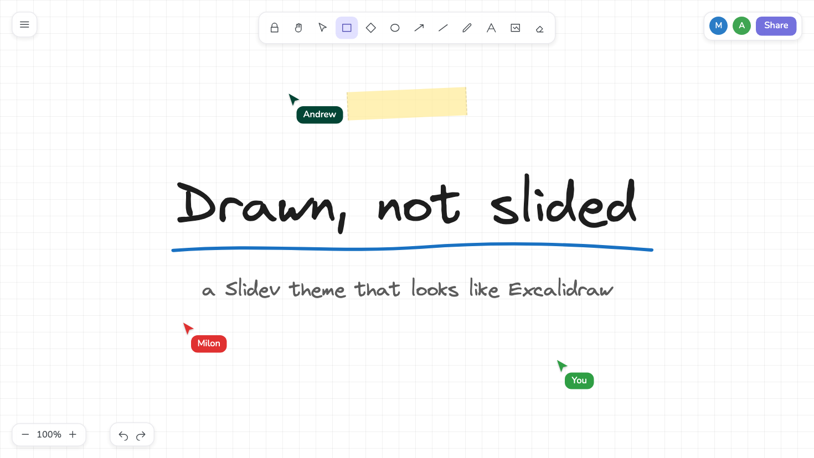
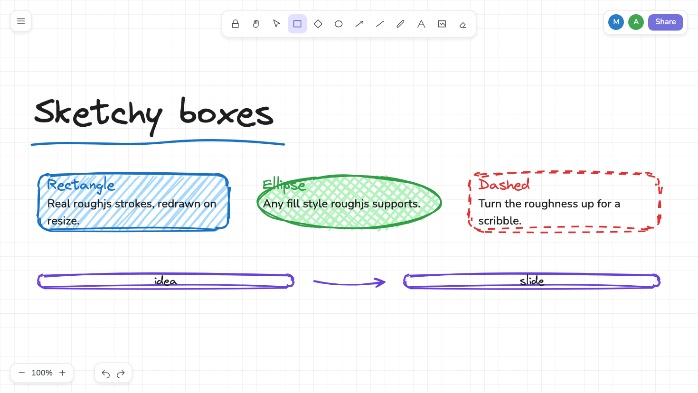
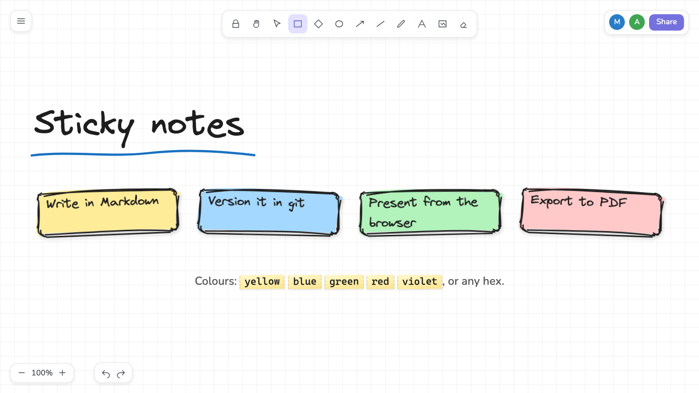
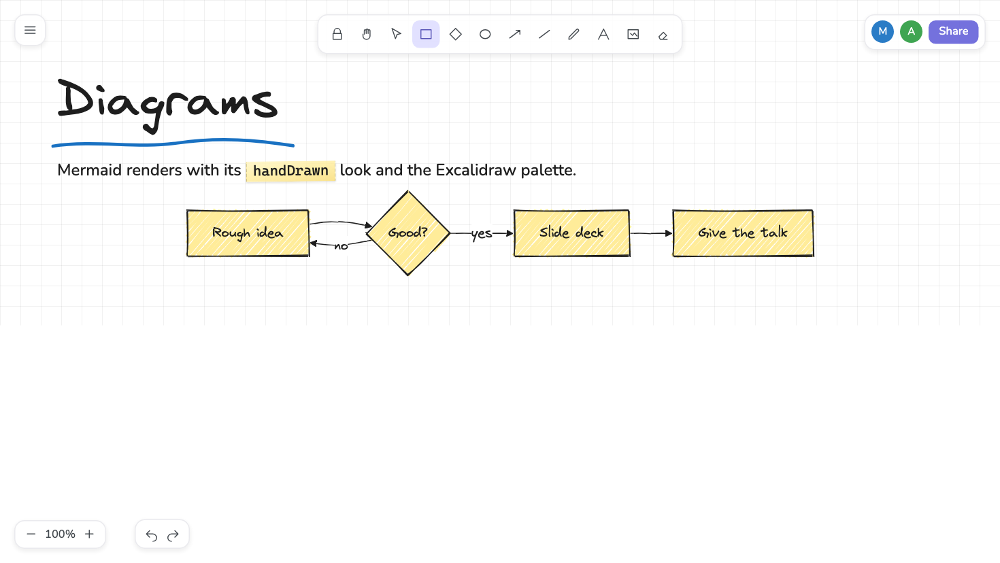
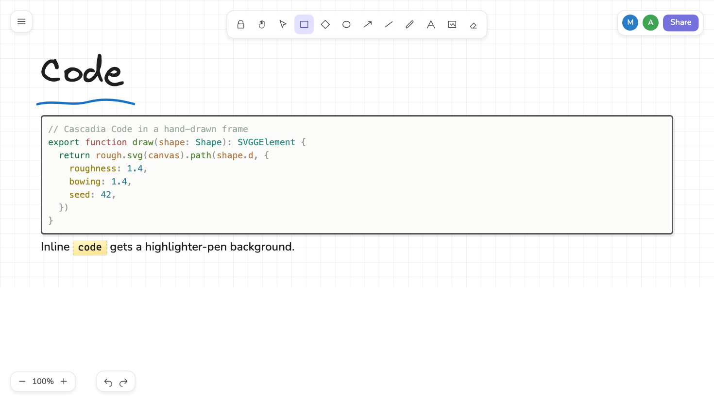
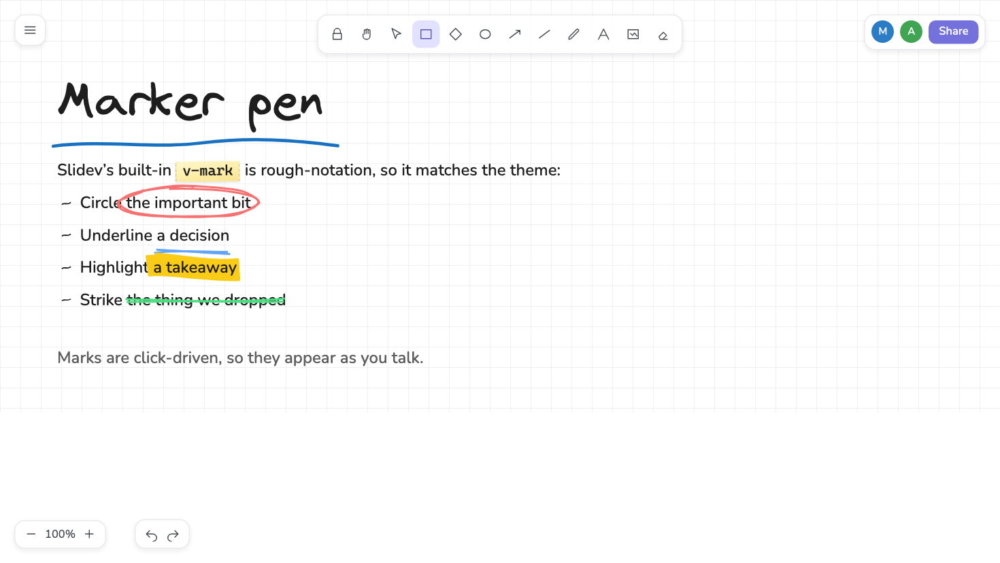

# slidev-theme-excalidraw

A [Slidev](https://sli.dev) theme that makes a deck look like it was drawn in
Excalidraw: real hand-drawn strokes (roughjs), Excalidraw's own fonts, the
squared canvas, and a decorative copy of the Excalidraw UI chrome.



## Install

Add the theme to your slides frontmatter. Slidev will prompt you to install it
if it is not already in `package.json`:

```md
---
theme: excalidraw
---
```

Or install it yourself:

```bash
npm install -D slidev-theme-excalidraw
```

Then use it like any other theme:

```md
---
theme: excalidraw
colorSchema: light
---

# Drawn, not slided
```

The package name is `slidev-theme-excalidraw`; Slidev resolves `theme: excalidraw`
to that name automatically.

## Screenshots

Sketchy containers and arrows, drawn with roughjs so every shape is a real
stroke rather than an image:



Sticky notes in the Excalidraw palette:



Mermaid diagrams pick up the `handDrawn` look automatically:



Code blocks sit in a wobbly frame, and inline code gets a strip of highlighter
tape:



## Layouts

| Frontmatter | What you get |
|---|---|
| `layout: sketch-cover` | Centered cover with a strip of masking tape |
| `layout: board` | Full-canvas layout for diagrams and boxes |

Built-in Slidev layouts (`default`, `center`, `two-cols`, …) keep the grid,
handwriting, and chrome.

## Per-slide switches

```yaml
---
layout: board
class: dots          # dotted paper; `no-grid` for a blank canvas
class: compact       # tighter headings and tables
chrome: false        # hide the fake Excalidraw toolbar
---
```

## Components

```md
<RoughBox color="#1971c2" fill="#a5d8ff">Boxed</RoughBox>
<RoughBox shape="ellipse" fill-style="cross-hatch">Round</RoughBox>
<RoughBox dashed :roughness="2.2">Scribbly</RoughBox>

<Sticky color="yellow" :tilt="-2">A note</Sticky>

<RoughArrow class="w-28" direction="right" />

<Cursor name="Milon" color="#e03131" top="60%" left="30%" />
```

`RoughBox` props: `color`, `fill`, `fillStyle` (`hachure` `solid` `zigzag`
`cross-hatch` `dots`), `roughness`, `strokeWidth`, `radius`, `shape`,
`dashed`, `seed`, `padding`. Shapes redraw on resize; pass `seed` to freeze a
specific squiggle.

## Marker pen

Slidev's built-in `v-mark` already uses rough-notation, so it matches:

```md
<span v-mark.circle.red="1">important</span>
<span v-mark.underline.blue="2">decision</span>
<span v-mark.highlight.yellow="3">takeaway</span>
```



## CSS helpers

`.handwritten`, `.ink-blue|red|green|yellow|violet|muted`,
`.hl-blue|red|green|yellow|violet`, `.tilt-l`, `.tilt-r`, `.sketch`.

## Developing the theme

```bash
npm install
npm run dev
```

`slides.md` uses `theme: ./` so you are previewing this package, not a published
copy.

## Releasing

A GitHub Actions workflow publishes to npm whenever you **publish a GitHub
Release**. The tag must match `package.json` (`v1.0.0` for version `1.0.0`).

1. Bump `"version"` in `package.json` and push to `master`.
2. On GitHub: **Releases → Draft a new release**, create tag `vX.Y.Z`, publish.
3. The [publish workflow](.github/workflows/publish.yml) runs `npm publish`.

## Fonts

Virgil, Nunito, and Cascadia Code are bundled with the theme (same files
Excalidraw ships). They are licensed under the SIL Open Font License.

## License

MIT
