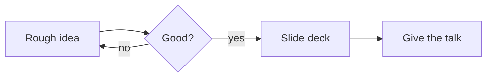

# Drawn, not slided

<div class="handwritten text-2xl ink-muted mt-6">
a Slidev theme that looks like Excalidraw
</div>

<Cursor name="Milon" color="#e03131" top="70%" left="22%" />
<Cursor name="Andrew" color="#034535" top="20%" left="35%" />
<Cursor name="You" color="#2f9e44" top="78%" left="68%" />

<!--
Everything here is plain Markdown. The Excalidraw look comes from this theme.
-->

---

# Real handwriting

This deck uses the fonts that ship with Excalidraw itself:

- **Virgil** for headings and anything `.handwritten`
- **Nunito** for body copy
- **Cascadia Code** for `code`

<div class="handwritten text-xl mt-6 ink-violet">
So a heading and a scribbled note look like the same pen.
</div>

> Blockquotes get a wobbly violet border.

---
layout: board
---

# Sketchy boxes

<div class="grid grid-cols-3 gap-6 mt-4">

<RoughBox color="#1971c2" fill="#a5d8ff">
<div class="handwritten text-xl ink-blue">Rectangle</div>
Real roughjs strokes, redrawn on resize.
</RoughBox>

<RoughBox shape="ellipse" color="#2f9e44" fill="#b2f2bb" fill-style="cross-hatch">
<div class="handwritten text-xl ink-green">Ellipse</div>
Any fill style roughjs supports.
</RoughBox>

<RoughBox color="#e03131" dashed :roughness="2.2">
<div class="handwritten text-xl ink-red">Dashed</div>
Turn the roughness up for a scribble.
</RoughBox>

</div>

<div class="flex items-center gap-4 mt-8">
  <RoughBox class="flex-1" color="#6741d9"><div class="text-center handwritten">idea</div></RoughBox>
  <RoughArrow class="w-28" color="#6741d9" />
  <RoughBox class="flex-1" color="#6741d9"><div class="text-center handwritten">slide</div></RoughBox>
</div>

---
layout: board
---

# Sticky notes

<div class="grid grid-cols-4 gap-5 mt-6">

<Sticky color="yellow" :tilt="-2">
<div class="handwritten text-lg">Write in Markdown</div>
</Sticky>

<Sticky color="blue" :tilt="1.5">
<div class="handwritten text-lg">Version it in git</div>
</Sticky>

<Sticky color="green" :tilt="-1">
<div class="handwritten text-lg">Present from the browser</div>
</Sticky>

<Sticky color="red" :tilt="2.4">
<div class="handwritten text-lg">Export to PDF</div>
</Sticky>

</div>

<div class="mt-10 text-center ink-muted">
Colours: <code>yellow</code> <code>blue</code> <code>green</code> <code>red</code> <code>violet</code>, or any hex.
</div>

---

# Marker pen

Slidev's built-in `v-mark` is rough-notation, so it matches the theme:

- Circle <span v-mark.circle.red="1">the important bit</span>
- Underline <span v-mark.underline.blue="2">a decision</span>
- Highlight <span v-mark.highlight.yellow="3">a takeaway</span>
- Strike <span v-mark.strike-through.green="4">the thing we dropped</span>

<div class="mt-8 ink-muted">
Marks are click-driven, so they appear as you talk.
</div>

---

# Diagrams

Mermaid renders with its `handDrawn` look and the Excalidraw palette.



---

# Code

```ts
// Cascadia Code in a hand-drawn frame
export function draw(shape: Shape): SVGGElement {
  return rough.svg(canvas).path(shape.d, {
    roughness: 1.4,
    bowing: 1.4,
    seed: 42,
  })
}
```

Inline `code` gets a highlighter-pen background.

---
layout: two-cols
---

# Tables

| Piece | Where |
|---|---|
| Theme | `theme: excalidraw` |
| Layouts | `board`, `sketch-cover` |
| Chrome | `chrome: false` to hide |

::right::

# Helpers

- `.handwritten` — Virgil
- `.ink-blue` `.ink-red` `.ink-green`
- `.hl-yellow` `.hl-violet`
- `.tilt-l` `.tilt-r`
- `class: dots` — dotted paper
- `class: no-grid` — blank canvas
- `class: compact` — tighter tables

---
layout: center
class: text-center no-grid
chrome: false
---

# No grid, no toolbar

Set `chrome: false` and `class: no-grid` in the slide frontmatter
when you want a clean canvas.

<div class="handwritten text-3xl ink-blue mt-8">Thanks!</div>
